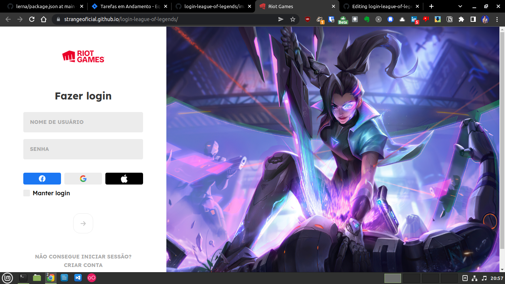

  
  <h1>Tela de Login do LOL</h1>
   
  

    Este é apenas um pequeno projeto bem simples, onde eu estou recriando a tela de login do jogo league of legends da empresa riot, uma pagina
    unica escrita em html, css e javascript.
  

 

